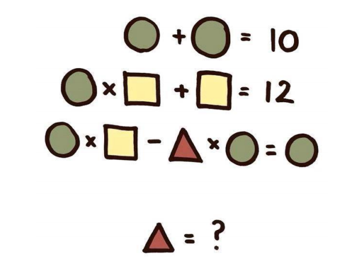
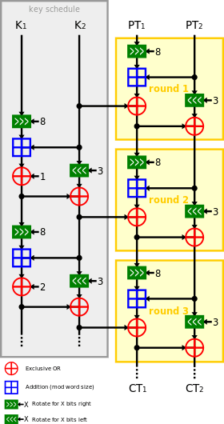

# Breaking Crypto with Z3   

This repo holds materials for our Splash 2017 class on Z3.

## Getting started with Z3

Z3 is a powerful theorem prover developed by Microsoft Research. Essentially, you can give Z3 a bunch of equations or constraints expressed in terms of variables, and it will do its best to find a solution that satisfies the constraints. Z3 is an example of an [*SMT Solver*](https://en.wikipedia.org/wiki/Satisfiability_modulo_theories). There's a rich theory underlying how to write good SMT solvers, but we're not concerned with any of that in this class. We'll just be using Z3 as a tool in order to break some cryptography.

### Installing

Z3 should already be installed on the computer you're using, but if you want to install it on another computer, you can either follow the instructions [here](https://github.com/Z3Prover/Z3) (use the `--python` flag when running `mk_make.py` to install the python bindings), or you can clone this git repository and run `install.sh`.

### Basics

This image was floating around facebook some time ago, with the caption "ONLY FOR GENiUS". Let's find the solution using Z3.



Check out `examples/only_for_genius.py`, reproduced below:

```python
from Z3 import *

circle, square, triangle = Ints('circle square triangle')
s = Solver()
s.add(circle + circle == 10)
s.add(circle * square + square == 12)
s.add(circle * square - triangle * circle == circle)
print s.check()
print s.model()
```

Let's go through it line by line:

* All of our Z3 programs will start with the line `from Z3 import *`. This imports all the Z3 python bindings.
* Next, we declare three integer variables, `circle`, `square` and `triangle`.
* Then, we instantiate a new solver `s` and we add our three constraints.
* Finally, we call the function `s.check()`. In any Z3 program, this function is doing all of the heavy lifting. It checks if a solution exists given our constraints and returns `sat` if yes, and `unsat` if no.
* Once we've verified that there is at least one solution, we can get Z3 to print it for us by asking it for its model.

When we run the program we see:

```
sat
[triangle = 1, square = 2, circle = 5]
```

## Let's roll!

Let's get warmed up with a relatively easy example — Sudoku

Sudoku is just a system of equations, and it's simple for Z3 to solve.


We can do this solely with the Z3 `Int` and `Distinct` types, plus some basic operators `And` and `<=`.

Check out `exercises/sudoku.ipynb`. Your task is to add the Z3 constraints for the individual cells, columns, and subsquares. (To get you started, we've given you the row constraints). Remember to enforce that the entries are all numbers from 1 to 9.

## Breaking 3SPECK

SPECK is a lightweight block cipher developed by the NSA and published in 2013.

It consists of 3 basic operations done on 64-bit numbers:

### XOR
The XOR operation is very common in cryptography. It's 0 if the two input bits are the same and 1 if the two input bits are different. When applied to 64-bit numbers, the XOR is computed bit-by-bit:

```
a = 0b10001111100010001 = 73489
b = 0b00111001001111000 = 29304
c = 0b10110110101101001 = 93545 <--- a XOR b
```

In python, the XOR operation is represented by the caret symbol (^)

```python
a = 73489
b = 29304
assert a ^ b == 93545
```

### Addition
This is standard grade-school addition. The one thing to note is that if the resulting sum is greater than 64-bits, it "overflows" and we only consider the lower 64 bits.

### Rotations
In a bit rotation, you literally rotate the bits of the number to the right or left by the amount specified by the operation.

Here is an example of a 3 bit right rotation:

```
a = 0b10001111100010001 = 73489
b = 0b00110001111100010 = 25570 <-- a >>> 3
```

Python doesn't have a native operation for bit rotation, but the following functions will do it for us:

```python
MASK = (1 << 64) - 1

# Rotate 64 bit integer x right by r
def ror(x, r):
  return ((x >> r) | (x << (64 - r))) & MASK

# Rotate 64 bit integer x left by r
def rol(x, r):
  return ((x << r) | (x >> (64 - r))) & MASK
```

### SPECK's round function:

SPECK makes heavy use of the following function `r`, which takes in three 64-bit numbers and modifies the first two numbers based on the third:

```python
# SPECK round function; x, y, and k are all 64 bits
def r(x, y, k):
  x = ror(x, 8)
  x += y
  x ^= k
  y = rol(y, 3)
  y ^= x
  return x, y
```

SPECK (or at least the version we're interested in) operates on 128-bit plaintext blocks. This block is immediately split into two 64-bit blocks, x and y. SPECK's key is also 128 bits long and is also split up into two 64-bit blocks, a and b.

In each round of SPECK, we use apply the `r` function to our plaintext (x and y) using b as the third argument. Then we modify our keys by applying the `r` function to our key (a and b) using the round number as the third argument.

SPECK normally includes 32 rounds. Our variant, 3SPECK, (that Z3 is able to break in a reasonable amount of time) uses only 3 rounds.



### Breaking 3SPECK with Z3

Check out `exercises/speck.ipynb`. We've implemented the SPECK cipher for you and provided you with a plaintext / ciphertext pair which uses some unknown key. Your task is to implemented the Z3 versions of 3SPECK's encrypt and round functions in order to derive the key. Once you have the key, we'll use it to try to decrypt a new ciphertext.

For this problem, the correct datatype to use are (64 bit) BitVecs, which act like Ints in many ways but support useful operations like `RotateRight` and `RotateLeft`. They also have the nice property that if you add two BitVecs that overflow, the resulting BitVec will only keep track of the last 64 bits.
